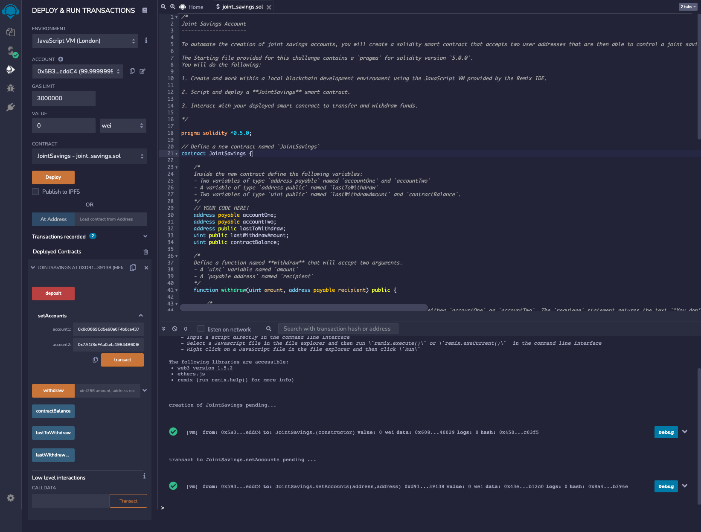

# Joint Savings Smart Contract (module_20_challenge)

A solidity contract that implements a joint savings account for two ethereum addresses.

---

## Technologies

- solidity 0.5.5

---

## Screenshots of Remix IDE

### 1. Set the two ethereum accounts using setAccounts

### 2. Deposit 1 eth as wei (includes contractBalance output)

### 3. Deposit 10 eth as wei (includes contractBalance output)

### 4. Deposit 5 eth (includes contractBalance output)

### 5. Withdraw 5 eth to accountOne (includes contractBalance, lastToWithdraw and lastWithdrawAmount outputs)

### 6. Withdraw 10 eth to accountTwo (includes contractBalance, lastToWithdraw and lastWithdrawAmount outputs)

---

## Contributors

---

## License

GNU GPLv3
